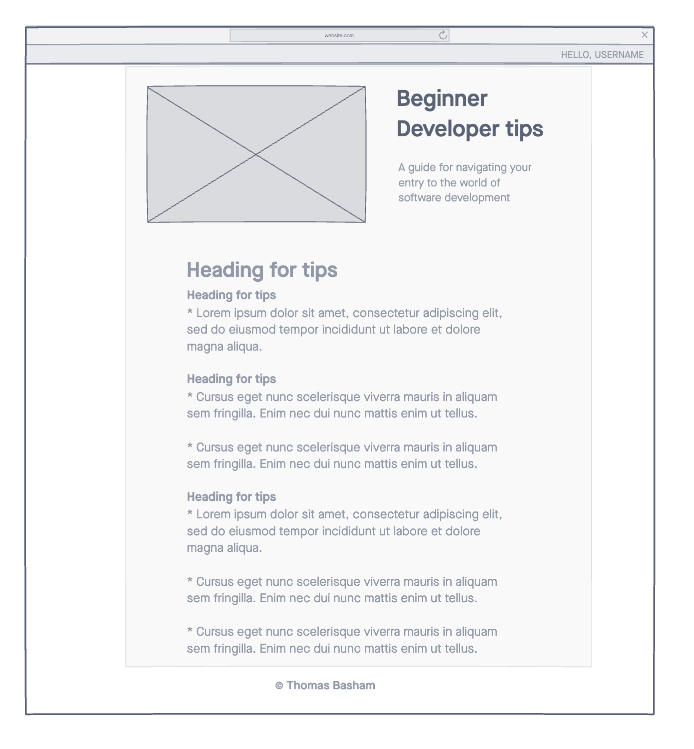
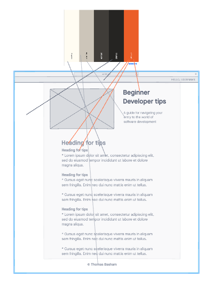

# Beginner Dev Tips

A website used to provide tips for beginner software developers. Users can play a fun trivia game and then read up on some practical tips for your journey into learning software development.

## Author: Thomas Basham

## Wire-frames

### Links and Resources

- [Coolors Palette](https://coolors.co/palette/fffcf2-ccc5b9-403d39-252422-eb5e28)

### Reflections and Comments

Creating this app helped me prepare for teaching a course at Codex Academy. Overall, it was a fun process taking a break from the usual web frameworks I work with and using what feels like primitive tools to the software developer. The constraints in this project were to only use skills and tools that will be taught in the course. This enticed me to thoroughly read through the curriculum and get a solid grasp of how I would teach topics such as HTML, CSS, and basic JavaScript.
